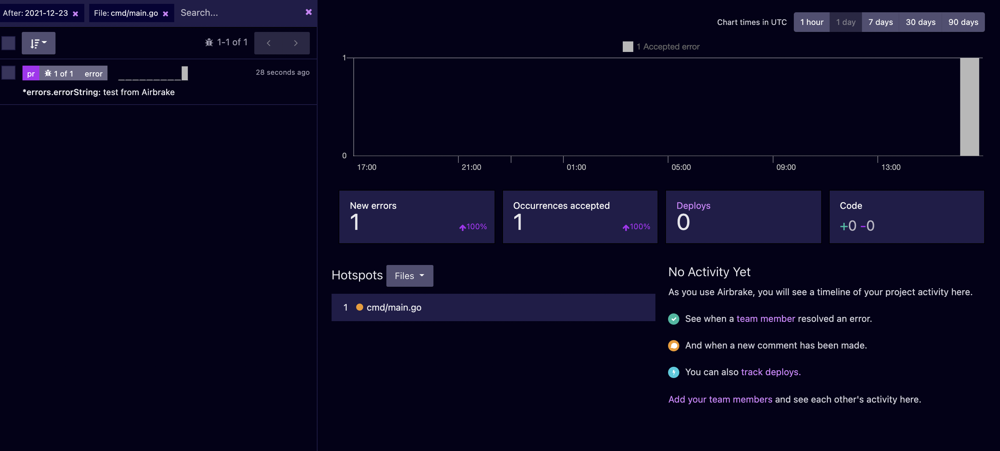

<h1 align="center">
Checkpoint
</h1>

Using JWT to authenticate the users of a web-application. The main idea
behind this project was to authorize our clients in a Golang service using JWT.

## What do you learn from this project?
- Middlewares in Golang
- JWT
- Airbrake

## What is JWT?
JSON Web Token (JWT) is an open standard 
(RFC 7519) that defines a compact and self-contained
way for securely transmitting information 
between parties as a JSON object. 

This information can be verified and 
trusted because it is digitally signed. 
JWTs can be signed using a secret 
(with the HMAC algorithm) or a 
public/private key pair using RSA or ECDSA.

Read more about [JWT](https://jwt.io/introduction).

## What is Airbrake?

Airbrake is the world's leading error 
tracking service. Thousands of engineering 
teams all over the world use Airbrake to capture, 
organize and alert their software exceptions, 
allowing them to find and fix bugs more quickly.

Read more about [Airbrake](https://www.airbrake.io/).

## How to use?
Clone the project and enter the following command:
```shell
go run main.go
```

### Endpoints
- **/api/login**
  - method = POST
  - input: username, password
- **/api/register**
  - method = POST
  - input: username, password
- **/api/user**
  - method = GET
  - input: username, token [header]

## Monitoring
Using airbrake dashboard to monitor our project:

